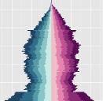

# IBMPopSim 

<!-- badges: start -->

<!--
[](https://github.com/rnabioco/valr/actions)
[](https://codecov.io/gh/rnabioco/valr)
[](https://CRAN.R-project.org/package=valr)
-->

<!-- badges: end -->

The IBMPopSim package aims at simulating the random evolution of
heterogeneous populations, called stochastic Individual Based Models
(IBMs). Such models have a wide range of applications in various fields
including actuarial sciences, biology, demography, or ecology. For
instance, IBMs can be used for simulating the evolution of an
heterogeneous insurance portfolio, of an spatial ecological population
with interacting individuals, or for validation mortality forecasts.

The package allows users to simulate population evolution in which
individuals are characterized by their age and some characteristics, and
where the population is modified by different types of events including
births/arrivals, death/exit events, or changes of characteristics. The
frequency at which an event can occur to an individual can depend on his
age and characteristics, but also on time and on the rest of the
population (interactions).

IBMPopSim overcomes the limitations of time consuming IBMs simulations.
This is done by implementing new efficient algorithms based on thinning
methods, which are compiled using the [Rcpp](http://www.rcpp.org)
library. The package allows a wide range of IMBs to be simulated, while
being user-friendly thanks to its structure based on simple build
blocks. In addition, we provide tools for analyzing outputs, such a
age-pyramids or life tables obtained from the simulated data, consistent
with the data format of packages for mortality modeling such as
[StMoMo](https://github.com/amvillegas/StMoMo). See
`vignette(IBMPopSim)` for more details.

## Installation

The latest stable version can be installed from CRAN:

``` r
install.packages('IBMPopSim')
```

The latest development version can be installed from github:

``` r
# install.packages("devtools")
devtools::install_github('giorgi/IBMPopSim')
```

### First example to check installation

To illustrate the use of the package and to check the installation, a
simple model with Poisson arrivals and exits is implemented.

``` r
library(IBMPopSim)

init_size <- 100000
pop <- data.frame(birth = rep(0, init_size), death = NA)

birth = mk_event_poisson(type = 'birth', intensity = 'lambda')
death = mk_event_poisson(type = 'death', intensity = 'mu')
params = list('lambda' = 100, 'mu' = 100)

# mk_model compiles C++ code using sourceCpp from Rcpp
birth_death <- mk_model(events = list(birth, death),
                        parameters = params)
```

If there are no errors then the C++ built environment is compatible with
the package. The model is created and a C++ code has been compiled. The
simulation is done using the `popsim` function.

``` r
sim_out <- popsim(model = birth_death, 
                  population = pop, 
                  events_bounds = c('birth' = params$lambda, 'death' = params$mu),
                  parameters = params, 
                  time = 10)
## Simulation on  [0, 10]

num_births <- length(sim_out$population$birth) - init_size
num_deaths <- sum(!is.na(sim_out$population$death))
print(c("births" = num_births, "deaths" = num_deaths))
## births deaths 
##    945   1004
```

## Quick model creation

  - We take here an initial population, stored in a data frame, composed
    of \(100\,000\) individuals marked by their gender (encoded by a
    Boolean characteristic):

<!-- end list -->

``` r
library("IBMPopSim")
```

``` r
pop <- EW_pop_14$sample
```

  - The second step is to define the model parameters’ list:

<!-- end list -->

``` r
params <- list("alpha" = 0.008, "beta" = 0.02, "p_male" = 0.51,
               "birth_rate" = stepfun(c(15,40), c(0,0.05,0)))
```

  - The last step is to defined the events that can occur in the
    population, here birth and death events:

<!-- end list -->

``` r
death_event <- mk_event_individual(type = "death",
                  intensity_code = "result = alpha * exp(beta * age(I, t));")

birth_event <- mk_event_individual(type = "birth", 
                  intensity_code = "result = birth_rate(age(I,t));",
                  kernel_code = "newI.male = CUnif(0, 1) < p_male;")
```

Note that these events contain some C++ statements that depend
(implicitly) on the previously declared parameters in variable `params`.

  - Finally, the model is created by calling the function `mk_model`. A
    C++ source code is obtained from the events and parameters, then
    compiled using the `sourceCpp` function of the `Rcpp` package.

<!-- end list -->

``` r
model <- mk_model(characteristics = get_characteristics(pop),
                  events = list(death_event, birth_event),
                  parameters = params)
```

  - In order to simulate a random trajectory of the population until a
    given time `T` bounds on the events intensities have to be
    specified:

<!-- end list -->

``` r
a_max <- 115
events_bounds = c("death" = params$alpha * exp(params$beta * a_max),
                  "birth" = max(params$birth_rate))
```

Then, the function `popsim` can be called:

``` r
sim_out <- popsim(model, pop, events_bounds, params,
                  age_max = a_max, time = 30)
## Simulation on  [0, 30]
```

  - The data frame `sim_out$population` contains the information (date
    of birth, date of death, gender) on individuals who lived in the
    population over the period \([0,30]\). Functions of the package
    allows to provide aggregated information on the population.

<!-- end list -->

``` r
pop_out <- sim_out$population
head(pop_out)
##       birth death  male
## 1 -84.99749    NA FALSE
## 2 -84.97524    NA FALSE
## 3 -84.94174    NA FALSE
## 4 -84.91351    NA  TRUE
## 5 -84.89490    NA FALSE
## 6 -84.86230    NA FALSE
female_pop <- pop_out[pop_out$male==FALSE, ]
age_pyramid(female_pop, ages = 85:90, time = 30)
##       age  male value
## 1 85 - 86 FALSE   235
## 2 86 - 87 FALSE   243
## 3 87 - 88 FALSE   221
## 4 88 - 89 FALSE   183
## 5 89 - 90 FALSE   198
Dxt <- death_table(female_pop, ages = 85:90, period = 20:30)
Ext <- exposure_table(female_pop, ages = 85:90, period = 20:30)
```

  - Note that parameters of the model can be changed without recompiling
    the model.

<!-- end list -->

``` r
params$beta <- 0.01

# Update death event bound:
events_bounds["death"] <- params$alpha * exp(params$beta * a_max)

sim_out <- popsim(model, pop, events_bounds, params,
                  age_max = a_max, time = 30)
```
