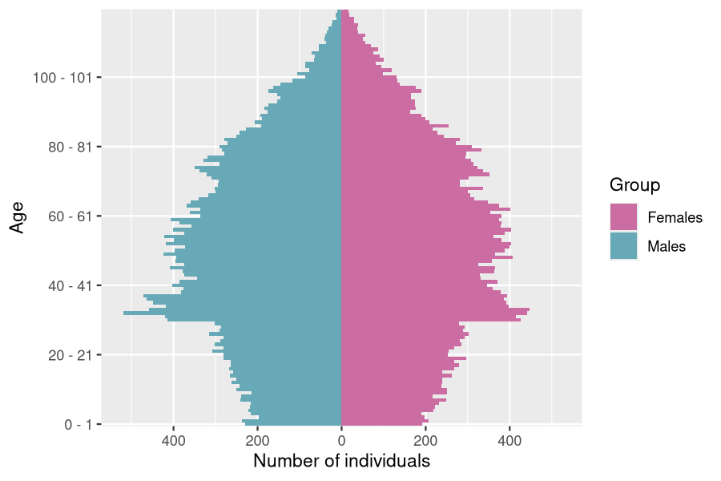

The R package `IBMPopSim` aims at simulatimg the random evolution of heterogeneous populations, called stochastic Individual-Based Models (IBMs), or agent-based models.
    The package enables users to simulate population evolution, in which individuals are characterized by their age and some characteristics, and the population is modified by different types of events, including births/arrivals, death/exit events, or changes of characteristics. The frequency at which an event can occur to an individual can depend on their age and characteristics, but also on the characteristics of other individuals (interactions).
    Such models have a wide range of applications in fields including  actuarial science, biology, ecology or epidemiology.

`IBMPopSim` overcomes the limitations of time-consuming IBMs simulations by implementing new efficient algorithms  based on thinning methods, which are compiled using the `Rcpp` package while providing a user friendly interface.

For a detailed description of the theoretical framework behind IBMs that can be implement in `IBMPopSim`, we refer to [@GioKaaLem2023]. We provide below the main guidelines for the understanding and implementing stochastic population evolution with `IBMPopSim`.

# Brief overview of Individual-Based-Models (IBMs)

Stochastic Individual-Based Models (IBMs) represent a broad class of random population dynamics models, allowing the description of population evolution on a microscopic scale.
Informally, an IBM can be summarized by the description of the individuals constituting the population, the various types of events that can occur to these individuals, along with their respective frequencies.

Let us start with a brief description of the class of IBMs that can be simulated using `IBMPopSim`.


## Individuals and population {#Pop}


First, individuals can be  characterized by  their age and/or a collection of discrete or continuous characteristics (position, subgroup, size, habits, ...). Formally, an individual is represented  by a triplet $I = (\tau^b, \tau^d, x)$ with:

- $\tau^b \in \mathbb R$ the date of birth, or $a(t) =t-\tau^b$ the age of the individual at time $t$.
- $\tau^d \in \bar{\mathbb R}$  the death date, with $\tau^d = \infty$ if the individual is still alive,
- a vector $x$ of characteristics.

The population at a given time $t$ is the set
$$Z_t=\{ I_k  ; \; k= 1,\dots, N_t\},$$
composed of all individuals (alive or dead) who have lived in the population before time $t$.


## Events type {#eventsTh}

The package enables users to simulate populations where one or more of the five following event types may occur:

- **Birth event**: addition of an individual of age 0 to the population.
- **Death event**: removal of an individual from the population.
- **Entry event**: arrival of an individual in the population.
- **Exit (emigration) event**: exit from the population (other than death).
- **Swap event**: an individual changes of characteristics.

With each event type is associated an **event kernel**,  describing how the population is modified following the occurrence of the event.  For some event types, the event kernel requires explicit specification. For example, in the case of a new individual entering the population (entry event), the model must define how the age and characteristics of this new individual are chosen.  For instance, the characteristics of a new individual in the population can be chosen uniformly in the space of all characteristics, or can depend on the distribution of his parents or those of the other individuals composing the population.


## Intensity classes {#Eventintensityth}

Finally, once the different types of events have been defined, it remains to describe how frequently the events can occur in the population.

Informally, an event intensity  is a function $\lambda^e_t(I, Z_t)$ describing the frequency at which an event $e$ can occur to *an individual* $I$, living in a population $Z_t$ at a time $t$. Given a history of the population $(\mathcal{F}_t)$, the probability of event $e$ occurring to individual $I$ during a small interval of time $(t,t+dt]$ is proportional to $\lambda^e(I,t)$:

\begin{equation}
  \mathbb{P}(\text{event } e \text{ occurring to $I$ during } (t,t+dt] | \mathcal{F}_t) \simeq \lambda^e_t(I, Z_t)dt.
\end{equation}

The intensity function $\lambda^e$ can include dependency on the individual's $I$ age $a(t)$ and characteristics $x$, the time $t$, or the population composition $Z$. The dependence of $\lambda^e$ on the population $Z$ models interactions between individuals in the populations.
Hence,  two types of  intensity functions can be implemented in IBMPopSim:

1. *No interactions (individual intensity):* The intensity function $\lambda^e$ does not depend on the population composition. The intensity at which the event of type $e$ occur to an individual $I$ only depends on its date of birth and characteristics:
\begin{equation}
(\#eq:intensityNointeraction)
\lambda^e_t (I,Z_t) = \lambda^e(t, I),
\end{equation}
where $\lambda^e: \mathbb{R}_+ \times \mathcal{I} \to \mathbb{R}^+$ is a deterministic function.

2. *``Quadratic'' interactions:*  The intensity at which an event of type $e$  occur to an individual $I$ depends on $I$ and on the population composition, through an interaction function $W^e$. The quantity $W^e(t, I,J)$ describes the intensity of interactions between two alive individuals $I$ and $J$ at time $t$, for instance in the presence of competition or cooperation.  In this case, we have
\begin{equation}
(\#eq:intensityInteraction)
\lambda^e_t(I,Z_t)=\sum_{j \in Z_t} W^e(t, I, J).
\end{equation}


See the `vignette('IBMPopSim_interaction')`  for an example of intensity with interaction (associated with the death event) and without interactions (associated with the birth event).

**Events intensity bounds** In order to simulate the population evolution by thinning for the various events intensities $\lambda^e_t(I,Z_t)$:

1. *No interactions (individual intensity):* The  individual event intensity  $\lambda^e$ with no interactions, as defined in \@ref(eq:intensityNointeraction),  is assumed to be  uniformly bounded:
\begin{equation}
(\#eq:boundlambda)
\lambda^e(t, I) \leq \bar \lambda^e.
\end{equation}

2. *``Quadratic'' interactions:* The interaction function $W^e$, as defined in \@ref(eq:intensityInteraction),  is assumed to be  uniformly bounded:
\begin{equation}
(\#eq:boundW)
W^e(t, I, J) \leq \bar W^e.
\end{equation}

In `IBMPopSim`, events can also occur in the population with a global intensity of Poisson type $(\mu^e_t)_{t \geq 0 }$,  which does not depend on individuals or the population composition, and assumed to be bounded by a constant $\bar \mu^e$. This can be the case for instance when we model arrivals in the population at a constant rate.


## Simulation algorithm {#algo}

The IBM simulation algorithm is based on an acceptance-rejection method for simulating random times called **thinning**, described in details in  [@GioKaaLem2023],  and generalizing the algorithm proposed by [@MELEARD2004] (see also [@MR2562651], [@boumezoued2016]).

The algorithm is based on  exponential ``candidate" event times.  Starting from time $t$, once a candidate event time $t + \bar T_\ell$ has been proposed, a candidate event type $e$ (birth, death,...) is chosen with a  probability $p^e$ depending on the event intensity bounds $\bar \lambda^e$ and $\bar W^e$.  A individual $I$ is then drawn from the population. Finally, it remains to  accept or reject the candidate event with a  probability  $q^e(t,I,Z_t)$ depending on the true event intensity. If the candidate event time is accepted, then the event $e$ occurs at time $t + \bar T_\ell$ to  the individual $I$. The main steps of the algorithm  can be summarized as follows:

1. Draw a candidate time $t + \bar T_\ell$ and candidate event type $e$.
2. Draw a uniform variable $\theta \sim \mathcal{U}([0, 1])$ and individual $I$.
3. **If** $\theta \leq q^e(t,I,Z_t)$ **then** event $e$ occur to individual $I$, **else** Do nothing and start again from $t + \bar T_\ell$.


# Package description

We can now detail the construction and simulation of an IBM using the package.
The implementation of an IBM model is based on a few building blocks, easy to manipulate. For code efficiency, the user shall write a few lines of C++ code to define events intensity and kernel. This code is concatenated with internal code in the package and the result is compiled internally using the `Rcpp` package. The produced model is usually very fast and can be multithreaded. Furthermore, the parameters of the model can be modified from a call to another without having to recompile the code.

## Installation


The latest stable version can be installed from CRAN:

``` r
install.packages('IBMPopSim')
```

The latest development version can be installed from github:

``` r
# install.packages("devtools")
devtools::install_github('DaphneGiorgi/IBMPopSim')
```

***First example to check installation***

To illustrate the use of the package and to check the installation, a simple model with Poisson arrivals and exits is implemented. Starting from an initial population `pop`, we define two events `birth` and `death` with intensity of Poisson type, we create the model `birth_death` and simulate the population evolution over 10 years.


``` r
library(IBMPopSim)

init_size <- 100000
pop_init <- population(data.frame(birth = rep(0, init_size), death = NA))

birth = mk_event_poisson(type = 'birth', intensity = 'lambda')
death = mk_event_poisson(type = 'death', intensity = 'mu')
params = list('lambda' = 100, 'mu' = 100)

# mk_model compiles C++ code using sourceCpp from Rcpp
birth_death <- mk_model(characteristics = get_characteristics(pop_init),
                        events = list(birth, death),
                        parameters = params)

sim_out <- popsim(model = birth_death, 
                  initial_population = pop_init, 
                  events_bounds = c('birth' = params$lambda, 'death' = params$mu),
                  parameters = params, 
                  time = 10)

num_births <- length(sim_out$population$birth) - init_size
num_deaths <- sum(!is.na(sim_out$population$death))
print(c("births" = num_births, "deaths" = num_deaths))
## births deaths 
##    967   1064
```

Let's now take a closer look at each component of a model in `IBMPopSim`, starting from the population.

## Population

A population $Z_t$ is represented by an object of class `?population` containing a data frame where each row corresponds to an individual $I=(\tau^b, \tau^d, x)$, and which has at least two columns, `birth` and `death`, corresponding to the birth date $\tau^b$ and death/exit date $\tau^d$ ($\tau^d$ is set to `NA` for alive individuals). The population can contain more than two columns if individuals are described by multiple characteristics $x= (x_1,\dots x_n)$.

**Type of a characteristic** A characteristic $x_i$ must be of atomic type: logical (`bool` in `C++`), integer (`int`), double (`double`) or character (`char`). The function `?get_characteristics` allows to easily get the characteristics names and their types (both in `R` and `C++`) from a `?population`.  We draw the attention to the fact that some names for characteristics are reserved to specific cases : this is the case for `birth, death, entry, out, id`.

**Entry and exit events** If **entry events** can occur in the population, the population shall contain a characteristic named `entry`. This can be done by setting the flag `entry=TRUE` in the `?population` function, or by calling the `?add_characteristic` function on an existing population.  During the simulation, the date at which an individual enters the population is automatically recorded in the variable `I.entry`.
If **exit events** can occur, the population shall contain a characteristic named `out`. This can be done by setting the flag `out=TRUE` in the `?population` function, or by calling the `?add_characteristic` function. When an individual `I` exits the population during the simulation, `I.out` is set to `TRUE` and its exit time is recorded as a ``death'' date.

In the example below, individuals are described by their birth and death dates, as well a Boolean characteristics called male, and the `entry` characteristic. For instance, the first individual is a female whose age at $t_0=0$ is $107$ and who was originally in the population.


``` r
pop_init <- population(EW_pop_14$sample,entry=TRUE)
str(pop_init)
## Classes 'population' and 'data.frame':	100000 obs. of  4 variables:
##  $ birth: num  -107 -107 -105 -104 -104 ...
##  $ death: num  NA NA NA NA NA NA NA NA NA NA ...
##  $ male : logi  FALSE FALSE TRUE FALSE FALSE FALSE ...
##  $ entry: logi  NA NA NA NA NA NA ...
```

**Individual** In the `C++` compiled model, an individual `I` is an object of an internal class containing some attributes (`birth_date`, `death_date` and the characteristics, here `male`), and some  methods:

- `I.age(t)`: a `const` method returning the age of an individual `I` at time `t`,
- `I.set_age(a, t)`: a method to set the age `a` at time `t` of an individual `I` (set `birth_date` at `t-a`),
- `I.is_dead(t)`: a `const` method returning `true` if the individual `I` is dead at time `t`.


## Events


The most important step of the model creation is the events creation.  The call to the function creating an event  is of form

```
mk_event_CLASS(type = "TYPE", name ="NAME", ...)
```

where `CLASS` is replaced by the class of the event intensity, as described in Section \@ref(Eventintensityth) and `type` corresponds to the event type of Section \@ref(eventsTh). They are  summarized in the below.
The other arguments depend on the intensity class and on the event type.


Table: Event types

Event type   `Type`   
-----------  ---------
Birth        `birth`  
Entry        `entry`  
Death        `death`  
Exit         `exit`   
Swap         `swap`   
Custom       `custom` 


Table: Intensity classes

Intensity class         `Class`                 
----------------------  ------------------------
Poisson                 `poisson`               
Inhomogeneous Poisson   `inhomogeneous_poisson` 
Individual              `individual`            
Interaction             `interaction`           


The intensity function and the kernel of an event are defined through
arguments of the function `mk_event_CLASS`. These arguments are
strings composed of few lines of code defining the  frequency of the event and
the action of the event on individuals. Since the model is compiled
using `Rcpp`, the code should be written in `C++`. However, thanks to the
model parameters and functions/variables of the package, even the
non-experienced `C++` user can define a model quite easily. Several
examples are given in the vignettes of this package, and basic
`C++` tools are presented in the `vignette('IBMPopSim_cpp')`.


The optional argument `name` gives a name to the event. If not
specified, the name of the event is its type, for instance
`death`. However, a name must be specified if the model is
composed of several events with the same type.


**Parameters**  In order to facilitate the implementation, the user can defined a list of model parameters, stored in a named list. The parameters can be of
atomic type, numeric vector or matrix,
predefined function of one variable ( `?stepfun`, `?linfun`, `?gompertz`,
  `?weibull`, `?piecewise_x`), or also
piecewise functions of two variables (`?piecewise_xy`). We refer to the \href{https://daphnegiorgi.github.io/IBMPopSim/articles/IBMPopSim_cpp.html}{online documentation} for more details on parameters types.
The parameters' name can be  used in the event and intensity definitions.
These names are fixed and cannot be modified after the compilation of the model,  whereas the values of parameters  can be modified from a simulation to another.


### Intensities

Following the description of events intensities given in Section \@ref(Eventintensityth), the intensity of an event $e$ belong to one of the following three classes: individual intensities without interaction between individuals ($e\in \mathcal{E}$), corresponding to \@ref(eq:intensityNointeraction), individual intensities with interaction ($e\in \mathcal{E}_W$), corresponding to events \@ref(eq:intensityInteraction), and (homogeneous or  inhomogeneous) Poisson intensities ($e\in \mathcal{P}$) $(\mu^e_t)_{t\geq 0}$.

**Event creation with individual intensity** An event $e\in \mathcal{E}$ has an intensity of the form $\lambda^e(t, I)$
which depends only on the individual $I$ and
time $t$. Events with such intensity are created using the function

```
mk_event_individual(type = "TYPE",
                    name = "NAME",
                    intensity_code = "INTENSITY", ...)
```

The `intensity_code` argument is a character string containing
few lines of `C++` code describing the intensity function $\lambda^e(t, I)$.
The intensity value has to be stored in a variable called
`result` and the
variables available (in addition to the model paramaters defined by the user) for the intensity code are given in the table below.


**Examples**

1. The intensity code below


``` r
death_intensity<- "if (I.male)
                       result = alpha_1*exp(beta_1*age(I, t));
                   else
                       result = alpha_2*exp(beta_2*age(I,t));"
```


corresponds to a death intensity equal to $d_1(a) = \alpha_1 \exp(\beta_1 a)$ for males and $d_2(a) = \alpha_2 \exp(\beta_2 a)$ for females. In this case, the intensity function depends on the individuals' age, gender, and on the model  parameters $\alpha = (\alpha_1, \alpha_2)$ and $\beta = (\beta_1, \beta_2)$.

2. This example creates a death event with intensity depending on age and time, equal to
\begin{equation*}
d(t,a) = 0.1\exp(0.005a) 1_{\{0\leq t <5\}} + 0.08\exp(0.005a) 1_{\{5\leq t\}}
\end{equation*}

This is done by creating the death function $d$ using the predefined package functions `?piecewise_xy` and `?gompertz`. The function is then recorded as a model parameter and used in the argument `intensity_code` of `?mk_event_individual`.


``` r
time_dep_function <- piecewise_xy(c(5),
                                  list(gompertz(0.1,0.005),
                                       gompertz(0.08,0.005)))
time_dep_function(0, 65) # death intensity at time 0 and age 65.
## [1] 0.1384031
params <- list("death_function"= time_dep_function)

death_event <- mk_event_individual(type = "death",
                    intensity_code = "result=time_dep_intensity(t,age(I,t));")
```


**Event creation with interaction intensity**  An event $e\in \mathcal{E}_W$ is an event
which occurs to an individual at a frequency which is the result of
interactions with other members of the population (see Equation \@ref(eq:intensityInteraction)), and which can be written as $\lambda^e_t(I, Z_t)=\sum_{J\in Z_t} W^e(t, I, J)$  where $W^e(t, I, J)$ is the intensity of the interaction between individual $I$ and individual $J$.

An event $e\in \mathcal{E}_W$ with such intensity is created by
calling the function

```
mk_event_interaction(type = "TYPE",
                     name = "NAME",
                     interaction_code = "INTERACTION_CODE",
                     interaction_type = "random", ...)
```
The `interaction_code` argument contains few lines of `C++` code
describing the interaction function $W^e(t, I, J)$. The interaction function
value has to be stored in a variable called `result` and the
available variables for the intensity code are given in the table below.

For example, if we set

```
death_interaction_code <- "result = max(J.size -I.size,0);"
```
the death intensity of an individual `I` is
the result of the competition between individuals, depending on a
characteristic named `size`.


The argument `interaction_type`, set by default at
`random`, is an algorithm choice for simulating the model. When
`interaction_type=full`, the intensity is computed according to \@ref(eq:intensityInteraction), which can be costly  for large populations. One way to avoid this summation, is to set the `interaction_type` to `random`. This corresponds to replace the summation by an evaluation of the interaction function $W^e$ using an individual $J$ drawn uniformly from the population.
In most cases, the `random` algorithm is much faster than the
`full` algorithm, as we illustrate for instance in the `vignette('IBMPopSim_interaction')`,
where we observe the gain of a factor of 20 between the two algorithms, on a set of standard parameters.
This allows in particular to explore parameter sets that give larger population sizes, without reaching computation times that explode.

Note that events with individual intensities are also much faster to
simulate since they only require to observe *one* individual to be
computed.


Table: C++ variables available for intensity code

Variable           Description                                                 
-----------------  ------------------------------------------------------------
`I`                Current individual                                          
`J`                Another individual in the population (only for interaction) 
`t`                Current time                                                
Model parameters   Depends on the model                                        


**Events creation with Poisson and Inhomogeneous Poisson
intensity** For events $e\in\mathcal{P}$ with an intensity $\mu^e(t)$ which does not
depend on the population, the event intensity is of class `inhomogeneous_poisson` or `poisson`
depending on whether or not the intensity depends on time (in the second case the intensity is constant).

For Poisson (constant) intensities the events are created with the
function

```
mk_event_poisson(type = "TYPE",
                 name = "NAME",
                 intensity = "CONSTANT", ...)
```
The following example creates a death event, where individuals die
at a constant intensity `lambda` (which has to be in the list of
model parameters).

```
mk_event_poisson(type = "death",
                 intensity = "lambda")
```


When the intensity depends on
time (but not on the population), the event can be created similarly by
using the function

```
mk_event_inhomogeneous_poisson(type = "TYPE",
                               name = "NAME"
                               intensity_code = "INTENSITY", ...)
```
The following example creates the same death event than before, but now individuals die at the rate $\lambda(1+ \cos(t))$.

```
mk_event_inhomogeneous_poisson(type = "death",
                               intensity_code = "result = lambda*(1+cos(t));")
```


### Event kernel code {#sub_par::event-kernel-code}

When an event occurs, the model should specify how the event modify the population. This behavior is described in  the `kernel_code` parameter of the `mk_event_CLASS(type = "TYPE", name ="NAME", ...)` function. The `kernel_code` is `NULL` by default and doesn't have to be specified for death, exit events and birth events, but **mandatory for entry and swap events**.  Recall that the `kernel_code` argument is a string composed of a few lines of `C++` code, characterizing the individual characteristics following the event. The table at the end of the section summarizes the list of available variables that can be used in the `kernel_code`.


1. **Death event** If the user defines a **death event**, the death date of the current individual `I`  is set to the current time `t`.

2. **Exit event** When  an individual `I` exits the population, `I.out` is set to `TRUE` and his exit time is recorded as a "death" date.

3. **Birth event** The default generated event kernel is that an individual `I` gives birth to a new individual `newI` of age 0 at the current time `t`, with same characteristics than the parent `I`. If no kernel is specified, the default generated C++ code for a birth event is:


```
individual newI = I;
newI.birth_date = t;
pop.add(newI);
```

The user can modify the birth kernel, by specify the argument `kernel_code` of `mk_event_CLASS`. In this case, the generated code is

```
individual newI = I;
newI.birth_date = t;
_KERNEL_CODE_
pop.add(newI);
```

where `_KERNEL_CODE_` is replaced by the content of the `kernel_code` argument. For instance, in a population where individuals are characterized by their gender, the  kernel code


``` r
birth_kernel_code <- "newI.male = (CUnif(0, 1) < p_male);"
```

creates new individuals which are males with  probability `p_male`, or females otherwise. Here, `p_male` should be included in the list of model parameters.

4. **Entry event**  When  an individual `I` enters the population, `I.entry` is set as the date at which the individual enters the population. When an entry  occurs the individual entering the population is not of age $0$. In this case, the user must specify the `kernel_code` argument indicating how the age and characteristics  of the new individual are chosen. For instance,


``` r
mk_event_poisson(type = "entry", name = "ev_example", intensity = "lambda",
                 kernel_code = "double a_I= max(CNorm(20,2),0);
                                newI.set_age(a_I,t);")
```

creates an event of type Entry, named `ev_example`, where individuals  enter the population at a constant intensity `lambda` (which has to be in the list of model parameters). When an individual `newI` enters the population at time `t`, his age is chosen as a normally distributed random variable, with mean 20 and variance 4, using the function `CNorm()` (see `vignette('IBMPopSim_cpp')`).


Table: C++ variables available for  events kernel code

Variable           Description                                                                  
-----------------  -----------------------------------------------------------------------------
`I`                Current individual                                                           
`t`                Current time                                                                 
` pop `            Current population (vector)                                                  
` newI `           New individual. By default for birth events `newI = I` with `newI.birth = t` 
Model parameters   Depends on the model                                                         


When there are several entry events, the user can identify which events generated the entry of an individual by adding a characteristic to the population recording the event name/id  when it occurs. The same holds for the other types of events. See e.g. `vignette('IBMPopSim_human_pop')` for an example with different death events.


## Model creation {#Modelcreation}

Once the population, the events, and model parameters are defined, the IBM model is created using the function
`?mk_model`.

```
model <- mk_model(characteristics = get_characteristics(pop_init),
                  event = events_list,
                  parameters = model_params)
```
During this step which can take a few seconds, the model is created and
compiled using the Rcpp package. One of the advantages of the model
structure in IBMPopSim is that the model depends only on the population
characteristics' and parameters names and types, rather than their
values. This means that once the model has been created, various
simulations can be done with different initial populations and
parameters values.

**Example**  Here is an example of model with a population structured by age and gender, with birth and death events. The death intensity of an individual of age $a$ is
$$d(a) = 0.008 \exp(0.02a),$$
and females between 15 and 40 can give birth with birth intensity 0.05. The newborn is a male with probability $p_{male}= 0.51$.


``` r
params <- list("p_male"= 0.51,
               "birth_rate" = stepfun(c(15,40),c(0,0.05,0)),
               "death_rate" = gompertz(0.008,0.02))


death_event <- mk_event_individual(type = "death", name= "my_death_event",
                  intensity_code = "result = death_rate(age(I,t));")

birth_event <- mk_event_individual( type = "birth",
                  intensity_code = "if (I.male)
                                        result = 0;
                                    else
                                        result=birth_rate(age(I,t));",
                  kernel_code = "newI.male = CUnif(0, 1) < p_male;")
pop <- population(EW_pop_14$sample)

model <- mk_model(characteristics = get_characteristics(pop),
                  events = list(death_event,birth_event),
                  parameters = params)

# summary(model)
```


## Simulation {#simulation}

Once the model has been created, the random evolution of the population can be simulated over a period of time $[0,T]$ by calling the function `popsim`:

```
popsim(model, pop_init, events_bounds, parameters, age_max=Inf, time,...)
```
where `model` is the model created in the previous step, `pop_init` is the initial population, `events_bounds` the event bounds, `parameters` is the  list  of parameters values, `age_max` is
the maximum age of individuals in the population  (set by default to `Inf`) and `time` is the final simulation time $T$ or a vector of times $(t_1, \dots ,t_n)$.

The IBM simulation algorithm for simulating random times is fully described in  [@GioKaaLem2023].

### Events bounds

Since the IBM simulation algorithm is based on an acceptance-rejection method for simulating random times, the user has to specify bounds for the intensity (or interaction) functions of each event (see assumptions \@ref(eq:boundlambda) and \@ref(eq:boundW)). These bounds should be stored  in a named vector, where for event $e$, the name corresponding to the event bound  $\bar{\mu}^e$, $\bar{\lambda}^e$ or  $\bar{W}^e$ is the event `name` defined during the event creation step.

**Example** In the model example built in the previous section, the birth intensity of an individual of age $a$ is $0$ if he is a male, and
$$ b(a) = 0.005  \mathbf{1}_{[15,40]},$$
if the individual is a female. Thus, the intensity bound for birth events is $\bar\lambda_b = 0.005$.

Since the death intensity function is not bounded, the user will have to specify a maximum age $a_{max}$ in `popsim` (all individuals above $a_{max}$ die automatically). Then, the bound for death events is

$$ \bar \lambda_d = 0.008\exp(0.02 a_{max}).$$

In our example, the death event has been named `"my_death_event"`. No name has been specified for the birth event which thus has the default name `"birth"`. Then,


``` r
a_max <- 120 # maximum age
events_bounds <- c("my_death_event" = 0.008*exp(0.02*a_max),
                   "birth" = max(params$birth_rate))
```

Note that the `?max` operator has been overloaded for some predefined functions of the package such as `?stepfun`.

### Simulation  {#Simulation1}


Once the model and events bounds have been defined, a random trajectory of the population can be simulated by calling


``` r
sim_out <- popsim(model, pop, events_bounds, params,
                  age_max = a_max, time = 30)
```

`sim_out` is a list composed of

* A list `arguments` of the simulation inputs, including the initial population, parameters and event bounds.
* A named numeric vector `logs` of variables related to the simulation algorithm.
* The simulation output called `population`.

When there are no swap events (individuals don't change of characteristics), the evolution of the population over the period $[0,30]$ is recorded in a `population` object called `sim_out$population`.
Each line of `sim_out$population` contains the information of an individual who lived in the population over the period $[0,30]$. This includes individuals who were initially in `pop`, as well as individuals who were born or entered the population.

The following Table <!--\@ref(tab:logs)--> describes the elements of the vector `sim_out$logs`containing information on  simulation algorithm:


Table: Logs parameters

|Elements           |Description                                                    |
|:------------------|:--------------------------------------------------------------|
|`proposed_events`  |Number of candidate event times proposed during the simulation |
|`effective_events` |Number of events which occured during the simulation           |
|`cleanall_count`   |Number of population cleans                                    |
|`duration_ns`      |Simulation time                                                |


For instance, the acceptance rate in the toy model is

``` r
sim_out$logs['effective_events']/sim_out$logs['proposed_events']
## effective_events 
##        0.2183868
```


**Optional parameters** If there are **no interactions** between individuals, i.e. if there
are no events with intensity of class `interaction`, then the
simulation can be parallelized easily by setting the optional parameter
`multithreading` (`FALSE` by default) to `TRUE`.
By default, the number of threads is the number of concurrent threads
supported by the available hardware implementation. The number of threads
can be set manually with the optional argument `num_threads`.
By default, when the proportion of dead individuals in the population exceeds $10\%$, the dead individuals are removed from the population. The user  can modify this ratio using the optional argument `clean_ratio`, or by removing dead individuals from the population with a certain frequency, given by the  `clean_step` argument. Finally, the user can also define the seed of the random number generator stored in the argument `seed`.

**Parameters modification and event removal** As explained in Section \@ref(Modelcreation) the structure of the compiled model  allows  the parameters' values to be changed without recompiling the model.  For instance, the parameter  of the Gompertz death function can be modified to study the impact of an increase in  mortality.
Before running the simulation, the events bounds should be updated accordingly accordingly. An event can also be removed by setting the corresponding event bound to 0.


``` r
params$death_rate <- gompertz(0.01,0.02) # New death rate

events_bounds["my_death_event"] <- 0.01*exp(0.02*a_max) # Death event bound update

new_sim_out <- popsim(model, pop, events_bounds,
                      params, age_max = a_max, time = 30) # Population simulation

```

### Outputs

Base functions to study the simulation outputs are provided in the package. For instance, the population age pyramid can computed at a give time (resp. at multiple dates) with the function `?age_pyramid` (resp. `?age_pyramids`). We refer to the other vignettes for more details on age pyramids computation and visualization.


``` r
pop_out <- sim_out$population

# Population age-pyramid at time 30:
pyr <- age_pyramid(pop_out, ages = 0:a_max, time = 30)
plot(pyr)
```

<div class="figure" style="text-align: center">

```{r, echo=FALSE, fig.align='center', out.width = '70%'}

```

</div>

Mortality tables with compatibles with packages such as StMoMo can also be computed by with the functions `?death_table` and `?exposure_table`.


``` r
female_pop <- pop_out[pop_out$male==FALSE, ]
Dxt <- death_table(female_pop, ages = 85:90, period = 20:30)    # Death table
Ext <- exposure_table(female_pop, ages = 85:90, period = 20:30)
```


## Simulation with swap events {#simulationswap}

When there are swap events (individuals can change of characteristics), recording the dates of swap events and changes of characteristics following each swap event is a memory intensive and computationally costly process.
To maintain efficient simulations in the presence of swap events, we propose the following solution.

###  Vector of times in `?popsim`.

In order to record individuals' characteristics at different dates, the argument `time` of `?popsim` can be replaced vector of dates $(t_0,\dots, t_n)$. In this case, `popsim` returns in the object `population` a list of $n$ `population` representing the population at time $t_1,\dots t_n$, simulated from  the initial time $t_0$.
For $i=1\dots n$, the $i$th data frame describes individuals who lived in the population during the period $[t_0,t_i]$,  with their characteristics at time $t_i$.


**Example**  We consider a population divided into two subgroups. Individuals can swap from subgroup 1 (resp. 2) to subgroup 2 (resp. 1) at  rate 0.1 (resp. 0.3).


``` r
pop <- population(data.frame("birth" = rep(0,1e5), "death" = rep(NA,1e5),
                  "sub_grp" = sample(1:2, 1e5, replace = TRUE)))

rates <- list( k12 = 0.1, k21=0.3)
#Only swap events occur in the population
swap_event <- mk_event_individual(type = "swap",
                  intensity_code = "if (I.sub_grp == 1) result = k12;
                                    else result = k21;",
                  kernel_code = "I.sub_grp = 3 - I.sub_grp;")

model_swap <- mk_model(characteristics = get_characteristics(pop),
                       events = list(swap_event),
                       parameters = rates)
## Warning in compatibility_chars_events(characteristics, events): The list of events contains a 'swap' event and there is no 'id' in the characteristics.
## Add 'id' to the characteristics if tracking changes along time is desired.
```

Then, the population is simulated from $t_0=0$ to $t_n =20$:


``` r
time_vec <- 0:20
sim_out <-popsim(model =model_swap, initial_population= pop,
                 events_bounds = c("swap"=max(unlist(rates))),
                 parameters =  rates,
                 time = time_vec,
                 multithreading = TRUE)
```

The model is an ergodic two states continuous time Markov chain with stationary distribution $(p_1,p_2)=(0,75,0.25)$. The figure below illustrates the convergence of the probability to be in subgroup 1 to $p_1$


``` r
pop_size <- nrow(pop)
# Mean number of individuals in subgroup 1 at each time:
p_1_t <- lapply(sim_out$population, function(pop_df){
                      return(nrow(subset(pop_df, sub_grp==1))/pop_size) })
```


```
## Error in parse(text = input): <text>:2:0: unexpected end of input
## 1: ggplot()+geom_line(aes(x=time_vec[-1],y=p_1_t)+xlab("Time")+ylab("Probability of subgroup 1")
##    ^
```

This example shows that IBMPopSim can also be used to simulated continuous time Markov Chain with finite state space.

### Individual life courses

It is possible also to isolate the individuals' life course, by adding an `id` column to the population, which can be done by setting `id=TRUE` in the population construction, or by calling the `?add_characteristic` function to an existing population, in order to identify each individual with a unique integer.


``` r
pop <- population(pop, id =TRUE)
model_swap_id <- mk_model(characteristics =  get_characteristics(pop),
                          events = list(swap_event),
                          parameters = rates)
```


``` r
sim_out_id <-popsim(model = model_swap_id,
                    initial_population = pop,
                    parameters = rates,
                    events_bounds = c("swap"=0.3),
                    time = seq(0,5, by=1),
                    multithreading = TRUE)
```


``` r
head(sim_out_id$population[[1]])
##   id birth death sub_grp
## 1  1     0    NA       1
## 2  9     0    NA       2
## 3 17     0    NA       2
## 4 25     0    NA       2
## 5 33     0    NA       1
## 6 41     0    NA       1
```

These data frames can be merged into a single data frame summarizing the life course of each individual, by calling the function `merge_pop_withid`.


``` r
pop_list <- sim_out_id$population
pop_merge <- merge_pop_withid(pop_list, chars_tracked='sub_grp')
head(pop_merge)
##      id birth death sub_grp_1 sub_grp_2 sub_grp_3 sub_grp_4 sub_grp_5
## 1     1     0    NA         1         1         1         1         1
## 2 32769     0    NA         2         1         1         1         1
## 3 65537     0    NA         2         2         2         2         2
## 4 98305     0    NA         2         1         2         2         1
## 5 31074     0    NA         1         1         1         1         1
## 6 63842     0    NA         1         1         1         1         2
```

Each line of `pop_merge` corresponds to the life course of one individual. However, the population is only represented at time $t=0,1..,5$, and this data frame doesn't account for exact swap event times or multiple swap events that occurred between between two time steps.


# References

<div id="refs"></div>
