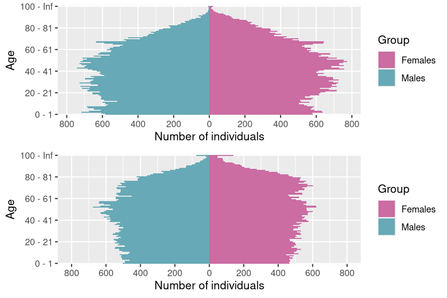
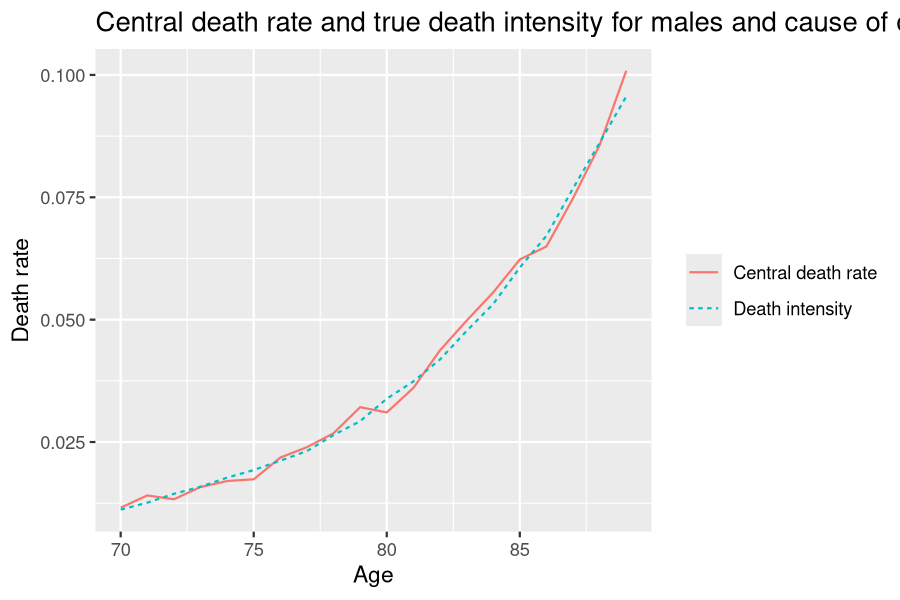

This document provides a first simple example of usage of the package `IBMPopSim`, for simulating a human population with birth and death events. See `vignette('IBMPopSim')` for a detailed presentation of the package.

# Example description

We consider a population in which individuals are characterized by their age and gender (male or female).

Individuals can give birth (only if female) or die. Birth and death intensities depend on the individuals' age and gender, but stay constant over time. In this toy model, birth and death intensities are fitted to England and Wales' 2014 birth and death rates (source: Office for National Statistics).


# Population creation

The initial population is created from a 100 000 individuals data frame sampled from England and Wales' 2014 age pyramid distribution (source: Office for National Statistics).


``` r
str(EW_pop_14)
## List of 3
##  $ age_pyramid:'data.frame':	232 obs. of  3 variables:
##   ..$ age  : Factor w/ 116 levels "0 - 1","1 - 2",..: 1 1 2 2 3 3 4 4 5 5 ...
##   ..$ male : logi [1:232] FALSE TRUE FALSE TRUE FALSE TRUE ...
##   ..$ value: num [1:232] 323863 340320 332357 350346 344972 ...
##  $ rates      :List of 3
##   ..$ birth       :'data.frame':	7 obs. of  2 variables:
##   .. ..$ age  : num [1:7] 15 20 25 30 35 40 45
##   .. ..$ value: num [1:7] 0.0156 0.0601 0.1008 0.1104 0.0645 ...
##   ..$ death_male  :'data.frame':	91 obs. of  2 variables:
##   .. ..$ age  : int [1:91] 0 1 2 3 4 5 6 7 8 9 ...
##   .. ..$ value: num [1:91] 4.03e-03 3.60e-04 1.52e-04 1.35e-04 7.73e-05 ...
##   ..$ death_female:'data.frame':	91 obs. of  2 variables:
##   .. ..$ age  : int [1:91] 0 1 2 3 4 5 6 7 8 9 ...
##   .. ..$ value: num [1:91] 0.003634 0.000226 0.000139 0.000121 0.000078 ...
##  $ sample     :'data.frame':	100000 obs. of  3 variables:
##   ..$ birth: num [1:100000] -107 -107 -105 -104 -104 ...
##   ..$ death: num [1:100000] NA NA NA NA NA NA NA NA NA NA ...
##   ..$ male : logi [1:100000] FALSE FALSE TRUE FALSE FALSE FALSE ...
```

When creating a `?population`, internal functions proceed to several checks, including verifications on appropriate column names and types.


``` r
pop_init <- population(EW_pop_14$sample)
```


``` r
plot(pop_init)
```

<div class="figure" style="text-align: center">

```{r, echo=FALSE, fig.align='center', out.width = '70%'}

```

</div>

# Model parameters

Birth and death rates are fitted to England and Wales' 2014 birth and death rates.


``` r
params <- with(EW_pop_14$rates,
    list("p_male" = 0.512, # probability to give birth to a male.
         "birth_rate" = stepfun(x=birth[,"age"], y=c(0,birth[,"value"])),
         "death_male" = stepfun(x=death_male[,"age"], y=c(0,death_male[,"value"])),
         "death_female" = stepfun(x=death_female[,"age"], y=c(0,death_female[,"value"]))
        )
      )
```

<div class="figure" style="text-align: center">

```{r, echo=FALSE, fig.align='center', out.width = '70%'}
knitr::include_graphics("hp_intensities-1.png")
```

</div>

# Events creation
There are 2 possible events :

- Birth
- Death

Both event intensities are of class `individual`, which means that the intensity at which an individual gives birth or dies only depends on his age and characteristics, and not on other individuals characteristics (in other words, there are no interactions).

The birth and the death intensities are bounded step functions, which are constant over time.


**Birth event creation**

``` r
birth_event <- mk_event_individual(
    type = "birth",
    intensity_code = "if (I.male) result = 0; else result = birth_rate(age(I, t));",
    kernel_code = "newI.male = CUnif(0, 1) < p_male;"
    # Newborn is male with probability p_male
)
```

**Death event creation**

``` r
death_event <- mk_event_individual(
    type = "death",
    intensity_code = "result = (I.male) ? death_male(age(I, t)) : death_female(age(I, t));"
)
```

# Model creation and simulation


## Model creation


``` r
model <- mk_model(
    characteristics = get_characteristics(pop_init), # Characteristics names and types
    events = list(birth_event, death_event), # Model events
    parameters = params # Model parameters
)
summary(model)
## Events description:
## [[1]]	
## Event class : individual 
## Event type : birth 
## Event name : birth
## Intensity code : 'if (I.male) result = 0; else result = birth_rate(age(I, t));' 
## Kernel code : 'newI.male = CUnif(0, 1) < p_male;' 
## [[2]]	
## Event class : individual 
## Event type : death 
## Event name : death
## Intensity code : 'result = (I.male) ? death_male(age(I, t)) : death_female(age(I, t));' 
## Kernel code : '' 
## 
## --------------------------------------- 
## Individual description:
## names:  birth death male 
## R types:  double double logical 
## C types:  double double bool 
## --------------------------------------- 
## R parameters available in C++ code:
## names:  p_male birth_rate death_male death_female 
## R types:  double closure closure closure 
## C types:  double function_x function_x function_x
```

**Computation of event intensity bounds** (needed for acceptance/rejection algorithm)


``` r
birth_max <- max(params$birth)
death_max <- with(params, max(max(death_male), max(death_female)))
```

## Simulation of the population over 50 years


``` r
sim_out <- popsim(model = model,
    initial_population = pop_init,
     #Vector of intensity bounds, with name corresponding to events name
    events_bounds = c('birth' = birth_max, 'death' = death_max),
    parameters = params,
    time = 50,
    age_max = 120,
    multithreading = TRUE)
```

**Simulation logs**


``` r
sim_out$logs
##  proposed_events effective_events   cleanall_count      duration_ns 
##          1679160           113202                6         54364564 
## attr(,"class")
## [1] "logs"    "numeric"
```

The ratio of accepted events is


``` r
sim_out$logs[["effective_events"]] / sim_out$logs[["proposed_events"]]
## [1] 0.06741585
```

**Outputs**

`sim_out$population` is an object of class `?population` given by a data frame composed of all individuals who lived in the population over the period $[0,50]$ (the individuals in the initial population and those born during the simulation period).
Each line corresponds to an individual, with his date of birth , date of death (`NA` if still alive at the end of the simulation) and gender.


The function `?age_pyramid` returns an object of `?pyramid` class containing the age pyramid of a population at a given time.


``` r
pyr_init = age_pyramid(sim_out$population, time = 0,ages = c(0:100,Inf))
pyr = age_pyramid(sim_out$population, time = 50, ages=c(0:100,Inf))
grid.arrange(plot(pyr_init),
             plot(pyr,value_breaks = seq(0,800,200)))
```

<div class="figure" style="text-align: center">

```{r, echo=FALSE, fig.align='center', out.width = '70%'}

```

</div>

Female age pyramid at t=50


``` r
plot(pyr[pyr$male==FALSE,c("age","value")], age_breaks = as.integer(seq(1,101,5)))
```

<div class="figure" style="text-align: center">

```{r, echo=FALSE, fig.align='center', out.width = '70%'}

```

</div>

`?age_pyramids` (plural) returns an object of `?pyramid` class representing the population age pyramids at different times.


``` r
pyrs = age_pyramids(sim_out$population, time = 1:50)
```

# Different simulations with the same model


## Change of initial population

The population evolution can be simulated starting from a different initial population, without having to recompile the model.


``` r
pop_sample_1e6 <- popsample(pyramid(EW_pop_14$age_pyramid), size = 1e6)
```


``` r
plot(pop_sample_1e6)
```

<div class="figure" style="text-align: center">

```{r, echo=FALSE, fig.align='center', out.width = '70%'}

```

</div>


``` r
sim_out <- popsim(model = model,
    initial_population = pop_sample_1e6,
    events_bounds = c('birth' = birth_max, 'death' = death_max),
    parameters = params,
    time = 50,
    age_max = 120,
    multithreading = TRUE)
```


``` r
sim_out$logs
##  proposed_events effective_events   cleanall_count      duration_ns 
##         16819678          1134604                6        487761662 
## attr(,"class")
## [1] "logs"    "numeric"
```

## Modify an intensity

Events intensities and/or kernels can be modified without recompiling the model, simply by changing the parameters value.

In the first toy model, mortality rates are assumed to be constant after age 90, with a maximum age of 120 in the population.  This leads to a significant increase in the number of individuals of age over 100, even though mortality rates don't change over time in this model.

A more realistic assumption is to assume that mortality rates increase after age 90, by changing the model parameters `death_male` and `death_female`. The two step functions are replaced by functions of type `?piecewise_x`, composed of a step function before age 90 and a linear function for older ages.


``` r
death_male_90 <- params$death_male
old_death_male <- linfun(x = c(89,120), y = c(death_male_90(89), 0.7)) #?linfun
params$death_male <- piecewise_x(c(89), list(death_male_90,old_death_male))

death_female_90 <- params$death_female
old_death_female <- linfun(x = c(89,120), y = c(death_female_90(89), 0.7))
params$death_female <- piecewise_x(c(89), list(death_female_90,old_death_female))
```

<div class="figure" style="text-align: center">

```{r, echo=FALSE, fig.align='center', out.width = '70%'}

```

</div>

Once the new model parameters have be defined, the event bounds must be updated.


``` r
sim_out_lin <- popsim(model = model,
                  initial_population = pop_sample_1e6,
                  events_bounds = c('birth' = birth_max, 'death' = 0.7),
                  parameters = params,
                  time = 50,
                  age_max = 120)
```

The modification of the shape of mortality rates for ages over 90 generates a decrease of about 10% (depending on the simulation) in the individuals aged over 100 after 50 years of simulation.


``` r
pop_size_90plus_const <- nrow(population_alive(sim_out$population,t = 50,a1=90))
pop_size_90plus_lin <- nrow(population_alive(sim_out_lin$population,t = 50,a1=90))
(pop_size_90plus_const-pop_size_90plus_lin)/pop_size_90plus_const*100
## [1] 6.070031
```

## Deactivate an event


An event can be deactivated by setting the event bound to 0.


``` r
sim_out <- popsim(model = model,
       initial_population = pop_init,
       events_bounds = c('birth' = 0, 'death' = death_max),
       parameters = params,
       age_max = 130,
       time = 50)
## [1] "event birth is deactivated"
```

The age pyramid can be directly plotted from an object of class `?population` with the `?plot` function.


``` r
grid.arrange(
    plot(sim_out$population, time=0, ages= 0:105),
    plot(sim_out$population, time=20, ages= 0:105)
    )
```

<div class="figure" style="text-align: center">

```{r, echo=FALSE, fig.align='center', out.width = '70%'}

```

</div>


``` r
age_pyramid(sim_out$population, ages = seq(70,90,10), time = 30)
##       age  male value
## 1 70 - 80 FALSE  5801
## 2 80 - 90 FALSE  3678
## 3 70 - 80  TRUE  5167
## 4 80 - 90  TRUE  2802
```

# Addition of "number of children" characteristic

The number of children by women can be recorded by adding a new characteristic (here named `children`) and changing the birth event kernel code.


``` r
chi <- get_characteristics(pop_init)
chi <- c(chi, 'children' = 'int') # Addition  of characteristic "chi"

```

**Birth event with children count**


``` r
new_birth_event <- mk_event_individual(
    type = "birth", name ="birth_child",
    intensity_code = "if (I.male) result = 0; else result = birth_rate(age(I, t));",
    kernel_code = " newI.male = CUnif(0, 1) < p_male;
                    newI.children = 0;
                    //When birth occur, I.children is increased of 1
                    I.children += 1;"
)
```


``` r
model_child <- mk_model(
    characteristics = chi,
    events = list(new_birth_event, death_event),
    parameters = params
)
summary(model_child)
## Events description:
## [[1]]	
## Event class : individual 
## Event type : birth 
## Event name : birth_child
## Intensity code : 'if (I.male) result = 0; else result = birth_rate(age(I, t));' 
## Kernel code : ' newI.male = CUnif(0, 1) < p_male;
##                     newI.children = 0;
##                     //When birth occur, I.children is increased of 1
##                     I.children += 1;' 
## [[2]]	
## Event class : individual 
## Event type : death 
## Event name : death
## Intensity code : 'result = (I.male) ? death_male(age(I, t)) : death_female(age(I, t));' 
## Kernel code : '' 
## 
## --------------------------------------- 
## Individual description:
## names:  birth death male children 
## R types:  double double logical integer 
## C types:  double double bool int 
## --------------------------------------- 
## R parameters available in C++ code:
## names:  p_male birth_rate death_male death_female 
## R types:  double closure closure closure 
## C types:  double function_x function_x function_x
```


``` r
init_pop <- population(cbind(pop_init, "children"=0))
head(init_pop)
##       birth death  male children
## 1 -106.9055    NA FALSE        0
## 2 -106.8303    NA FALSE        0
## 3 -104.5097    NA  TRUE        0
## 4 -104.2218    NA FALSE        0
## 5 -103.5225    NA FALSE        0
## 6 -103.3644    NA FALSE        0
```


``` r
sim_out <- popsim(model_child,
       initial_population = init_pop,
       events_bounds = c('birth_child' = birth_max, 'death' = death_max),
       parameters = params,
       time = 100,
       age_max = 120,
       multithreading=TRUE)
```


``` r
# Females of age over 50 alive at time 100:
pop_female_time <- population_alive(subset(sim_out$population, male == F), t= 100, a1= 50)
dim(pop_female_time)[1]# Number of females over 50
## [1] 16906
```

<div class="figure" style="text-align: center">

```{r, echo=FALSE, fig.align='center', out.width = '70%'}

```

</div>


``` r
mean(pop_female_time$children) #Mean number of children
## [1] 1.828818
```

# Addition of "cause of death" characteristics

In order to model different competing  causes of death, several death events can be created, each modeling one cause of death.

## Model with two independent causes of death

Individuals can die from two main causes of death 1 and 2, supposed to be independent. Then, the death intensity at age $a$ is

$$ \mu(a) = \mu_1(a) + \mu_2(a),$$

where $\mu_i(a)$ is the death intensity at age $a$ associated with cause $i$.

This model can be simulated with two death events associated to cause 1 and 2, and adding a new characteristic recording the cause of death.


``` r
chi <- get_characteristics(pop_sample_1e6)
chi <- c(chi, 'CoD' = 'int')
```


``` r
params$CoD1_prop <- 0.6
```


``` r
death_event1 <- mk_event_individual(
                type = "death",
                name="CoD1",
                intensity_code = "if (I.male) result = CoD1_prop*death_male(age(I,t));
                                  else result= CoD1_prop*death_female(age(I,t));",
                kernel_code = "I.CoD =1;" # Records cause of death when event occurs
                                    )
death_event2 <- mk_event_individual(
                type = "death",
                name="CoD2",
                intensity_code = "if (I.male) result = (1-CoD1_prop)*death_male(age(I,t));
                                  else result= (1-CoD1_prop)*death_female(age(I,t));",
                kernel_code = "I.CoD =2;"
                                    )
```


``` r
# Model creation
model_CoD <- mk_model(characteristics = chi,
                events = list(birth_event, death_event1, death_event2),
                parameters = params)
```


``` r
init_pop_CoD <- population(cbind(pop_sample_1e6, "CoD"=NA)) # Initial population
```


``` r
ev_bounds <- c('birth' = birth_max,
               'CoD1' = params$CoD1_prop*death_max,
               'CoD2' = (1-params$CoD1_prop)*death_max)

sim_out_CoD <- popsim(model_CoD,
                  initial_population = init_pop_CoD,
                  events_bounds = ev_bounds,
                  parameters = params,
                  time = 20,
                  age_max = 120,
                  multithreading=TRUE)
```

## Death and exposure table

The number of death for given age groups, time periods and for each cause of death can be computed with `?death_table`.
Example below: number of  males death of age between $[70,90]$ (single year of age groups) over the 5-year period $[15,20]$, for each cause.


``` r
Dx_1 <- death_table(subset(sim_out_CoD$population, CoD==1 & male==TRUE),
                    ages = 70:90,
                    period = c(15,20))
Dx_2 <- death_table(subset(sim_out_CoD$population, CoD==2 & male==TRUE),
                    ages = 70:90,
                    period = c(15,20))
```


``` r
# Central exposure to risk:
Ex <- exposure_table(subset(sim_out_CoD$population, male==TRUE),
                    ages = 70:90,
                    period = c(15,20))
# Males central death rates by for Cause 1:
mx_1 <- Dx_1/Ex
# Males central death rates by for Cause 2:
mx_2 <- Dx_2/Ex
```

<div class="figure" style="text-align: center">

```{r, echo=FALSE, fig.align='center', out.width = '70%'}

```

</div>
